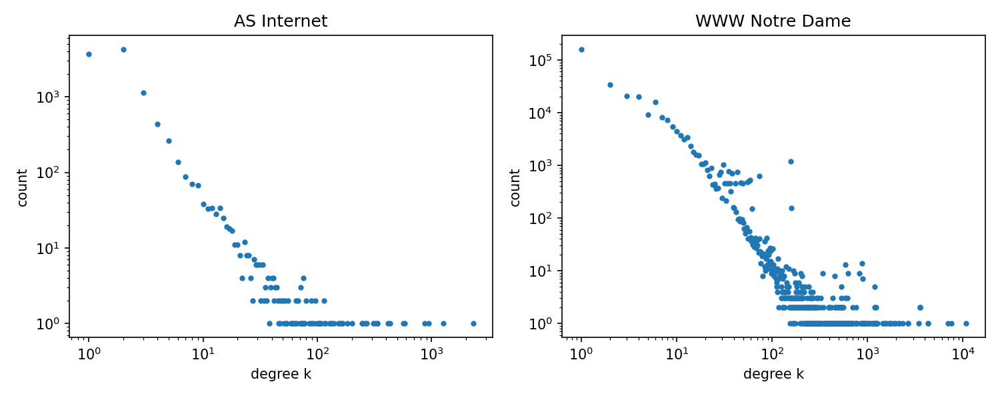
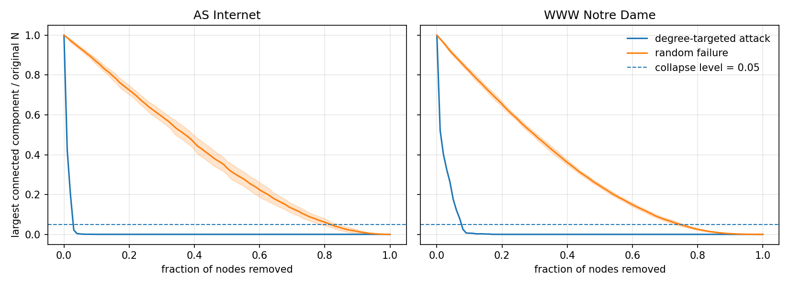

# Findings for the project
## Step 1: exploring the networks

| Network | Nodes | Edges | ⟨k⟩ | ⟨k²⟩ | ⟨k²⟩/⟨k⟩ | Giant Component (%) |
|---|---:|---:|---:|---:|---:|--------------------:|
| AS Internet | 10,670 | 22,002 | 4.124 | 1040.112 | 252.204 |              1.0000 |
| WWW Notre Dame | 325,729 | 1,117,563 | 6.862 | 1889.972 | 275.429 |              1.0000 |

### Figure 1: Power-law fits (discrete=True)

- AS Internet: α = 2.070, xmin = 6
  - LR vs lognormal: R = −0.35, p = 0.638
  - Power law and lognormal are statistically indistinguishable; α is consistent with Faloutsos et al. (1999) finding (~2.2).
- WWW Notre Dame: α = 2.156, xmin = 6
  - LR vs lognormal: R = −170, p < 0.001
  - Lognormal is strongly preferred over pure power law for this dataset.

Both networks have heavy-tailed degree distributions (⟨k²⟩/⟨k⟩ ≈ 250 confirms this) with power-law 
exponents in the canonical 2–2.2 range. However, the Notre Dame web graph is better described by lognormal than a
pure power law, consistent with the broader literature suggesting many "scale-free" networks have power-law-with-cutoff 
or lognormal tails (Broido & Clauset 2019). This deviation from a pure scale-free model is itself a result, and 
motivates comparing the real networks against the BA null model to see whether percolation behavior also deviates.

## Step 2: percolation process

| Network | Strategy | Threshold (mean) | Threshold (std) | Runs | Collapse Level |
|---|---|---:|---:|---:|---:|
| AS Internet | Random failure | 0.821462 | 0.028335 | 20 | 0.05 |
| AS Internet | Degree-targeted attack | 0.029991 | 0.000000 | 1 | 0.05 |
| WWW Notre Dame | Random failure | 0.748499 | 0.014239 | 20 | 0.05 |
| WWW Notre Dame | Degree-targeted attack | 0.079999 | 0.000000 | 1 | 0.05 |

### Figure 2: percolation curves
