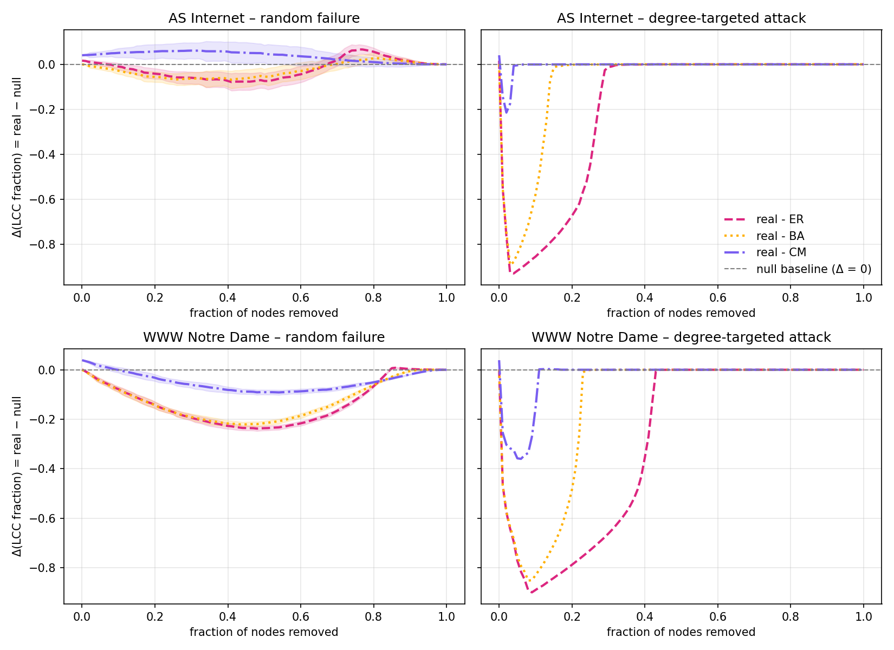

# Findings for the project
## Step 1: exploring the networks

| Network | Nodes | Edges | ⟨k⟩ | ⟨k²⟩ | ⟨k²⟩/⟨k⟩ | Giant Component (%) |
|---|---:|---:|---:|---:|---:|--------------------:|
| AS Internet | 10,670 | 22,002 | 4.124 | 1040.112 | 252.204 |              1.0000 |
| WWW Notre Dame | 325,729 | 1,117,563 | 6.862 | 1889.972 | 275.429 |              1.0000 |

### Figure 1: Power-law fits (discrete=True)

- AS Internet: α = 2.070, xmin = 6
  - LR vs lognormal: R = −0.35, p = 0.638
  - Power law and lognormal are statistically indistinguishable; α is consistent with Faloutsos et al. (1999) finding (~2.2).
- WWW Notre Dame: α = 2.156, xmin = 6
  - LR vs lognormal: R = −170, p < 0.001
  - Lognormal is strongly preferred over pure power law for this dataset.

Both networks have heavy-tailed degree distributions (⟨k²⟩/⟨k⟩ ≈ 250 confirms this) with power-law 
exponents in the canonical 2–2.2 range. However, the Notre Dame web graph is better described by lognormal than a
pure power law, consistent with the broader literature suggesting many "scale-free" networks have power-law-with-cutoff 
or lognormal tails (Broido & Clauset 2019). This deviation from a pure scale-free model is itself a result, and 
motivates comparing the real networks against the BA null model to see whether percolation behavior also deviates.

## Step 2: percolation process

| Network | Strategy | Threshold (mean) | Threshold (std) | Runs | Collapse Level |
|---|---|---:|---:|---:|---:|
| AS Internet | Random failure | 0.821462 | 0.028335 | 20 | 0.05 |
| AS Internet | Degree-targeted attack | 0.029991 | 0.000000 | 1 | 0.05 |
| WWW Notre Dame | Random failure | 0.748499 | 0.014239 | 20 | 0.05 |
| WWW Notre Dame | Degree-targeted attack | 0.079999 | 0.000000 | 1 | 0.05 |

### Figure 2: percolation curves

## Step 3:

## Step 4: deviations from the null models

| Network | Strategy | Null | f_c (real) | f_c (null) | Δf_c |
|---|---|---|---:|---:|---:|
| AS Internet | Random failure | ER | 0.821 | 0.739 | +0.083 ± 0.031 |
| AS Internet | Random failure | BA | 0.821 | 0.786 | +0.036 ± 0.033 |
| AS Internet | Random failure | CM | 0.821 | 0.803 | +0.019 ± 0.035 |
| AS Internet | Degree-targeted attack | ER | 0.029 | 0.280 | −0.260 |
| AS Internet | Degree-targeted attack | BA | 0.030 | 0.150 | −0.120 |
| AS Internet | Degree-targeted attack | CM | 0.030 | 0.040 | −0.019 |
| WWW Notre Dame | Random failure | ER | 0.748 | 0.830 | −0.082 ± 0.014 |
| WWW Notre Dame | Random failure | BA | 0.750 | 0.841 | −0.093 ± 0.015 |
| WWW Notre Dame | Random failure | CM | 0.750 | 0.850 | −0.099 ± 0.015 |
| WWW Notre Dame | Degree-targeted attack | ER | 0.080 | 0.430 | −0.350 |
| WWW Notre Dame | Degree-targeted attack | BA | 0.080 | 0.230 | −0.150 |
| WWW Notre Dame | Degree-targeted attack | CM | 0.080 | 0.101 | −0.030 |

### Figure 4: real-minus-null deviation curves

| Network | Strategy | Gap to ER | Gap to BA | Gap to CM | Explained by BA | Explained by CM |
|---|---|---:|---:|---:|---:|---:|
| AS Internet | Random failure | 0.083 | 0.036 | 0.011 | 56.9 % | 77.6 % |
| AS Internet | Degree-targeted attack | 0.260 | 0.120 | 0.019 | 53.9 % | 96.2 % |
| WWW Notre Dame | Random failure | 0.082 | 0.093 | 0.099 | −13.5 % | −22.1 % |
| WWW Notre Dame | Degree-targeted attack | 0.350 | 0.150 | 0.030 | 57.1 % | 91.4 % |

- **Targeted attack:** for both networks, ~90 % of the real-vs-ER threshold gap is closed by moving to CM (96 % for AS, 91 % for WWW); BA alone closes only ~55 %. The targeted-attack response is therefore essentially a function of the exact degree sequence. BA underestimates it because BA's heavy tail is not heavy enough.
- **Random failure, AS:** the gap shrinks steadily across ER → BA → CM, and Δf_c against CM is within one standard deviation of zero. AS is well-described by all three nulls.
- **Random failure, WWW:** the gap does not shrink but slightly widens across ER → BA → CM, so the WWW deviation cannot be a heavy-tail effect at all — it is a higher-order effect. The leading candidate is clustering: WWW has clustering 0.235 in the real graph versus 0.007 in CM, i.e. CM destroys nearly all of it.

The targeted-attack fragility of both networks is reproduced almost entirely by fixing the exact degree sequence and is therefore essentially a degree-distribution effect, with BA underestimating it because of its α = 3 tail. The random-failure response, however, distinguishes the two systems: for AS the heavy tail is sufficient, whereas for WWW the residual fragility survives even after the degree sequence is fixed, pointing to higher-order structure as the source. The heavy-tailed degree distribution alone is therefore not sufficient to reproduce the observed fragility, and the additional fragility is system-specific rather than shared.
